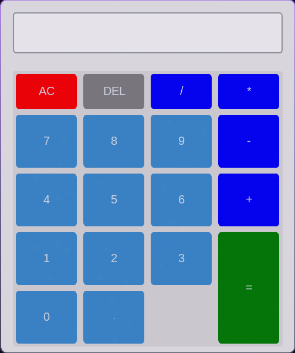

# Python Calculator with GUI

A modern desktop calculator application built with Python and CustomTkinter library. This calculator features a clean, intuitive interface with both mouse and keyboard support.



## Features

- **Basic arithmetic operations**: addition (+), subtraction (-), multiplication (*), division (/)
- **Decimal numbers support**
- **Keyboard input support** for all operations
- **Error handling** for syntax errors and division by zero
- **Modern UI** with system appearance mode (Dracula theme)
- **Responsive design** with grid-based button layout

## Keyboard Shortcuts

| Key | Function |
|-----|----------|
| `0-9` | Input numbers |
| `+` | Addition |
| `-` | Subtraction |
| `*` | Multiplication |
| `/` | Division |
| `.` | Decimal point |
| `=` or `Enter` | Calculate result |
| `Backspace` | Delete last character |
| `Escape` | Clear all (AC) |

## Installation

1. Clone the repository:
```bash
git clone https://github.com/Fkernel653/fcalc.git
cd fcalc
```

2. Install the required dependency:
```bash
pip install customtkinter
```

3. Run the calculator:
```bash
python main.py
```

## Requirements

- Python 3.6 or higher
- customtkinter library

## Project Structure

```
fcalc/
├── main.py           # Main calculator application
├── style.py          # Main style
├── README.md         # Project documentation
└── screenshot.png    # Application screenshot
```

## Code Overview

The calculator is built using object-oriented programming principles:

- **Calc class**: Main application class inheriting from `customtkinter.CTk`
- **UI Components**: Buttons, display entry, and frame layout
- **Event Handlers**: Keyboard and mouse input processing
- **Calculation Engine**: Uses Python's `eval()` for expression evaluation with error handling

## Error Messages

The calculator displays user-friendly error messages:
- `Error: The syntax is incorrect` - For invalid mathematical expressions
- `Error: Division by zero` - When attempting to divide by zero

## Customization

You can easily customize the calculator by modifying:

- **Window size**: Change `self.geometry('500x600')`
- **Colors**: Modify style Dracula for buttons and menu
- **Font**: Change class `Button`
- **Appearance**: Change `self.configure()` to change the background

## Contributing

Contributions are welcome! Feel free to:

1. Fork the repository
2. Create a new branch (`git checkout -b feature/improvement`)
3. Make your changes
4. Commit your changes (`git commit -am 'Add new feature'`)
5. Push to the branch (`git push origin feature/improvement`)
6. Open a Pull Request

## License

This project is open source and available under the [MIT License](LICENSE).

## Author

**Fkernel653** - [GitHub Profile](https://github.com/Fkernel653)

## Acknowledgments

- [CustomTkinter](https://github.com/TomSchimansky/CustomTkinter) library for modern UI widgets
- Python community for excellent documentation and support

---

If you find this project helpful, please give it a ⭐ on GitHub!
